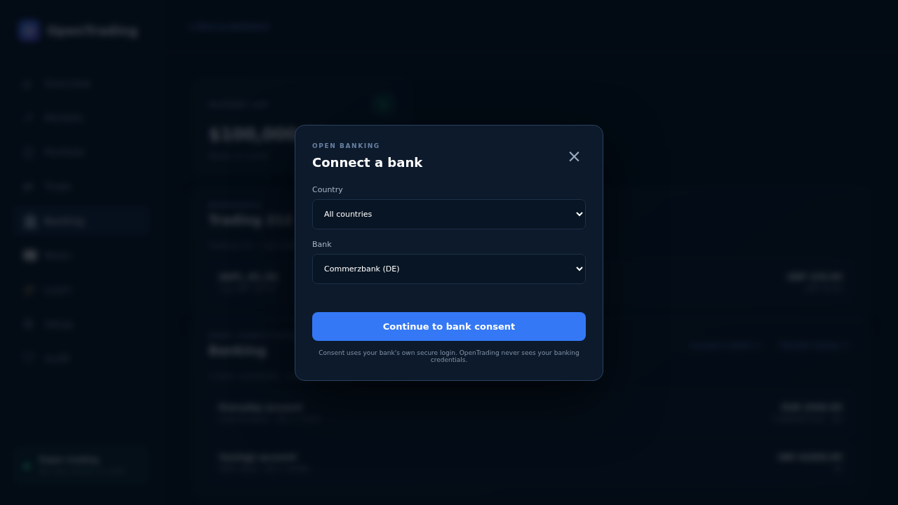
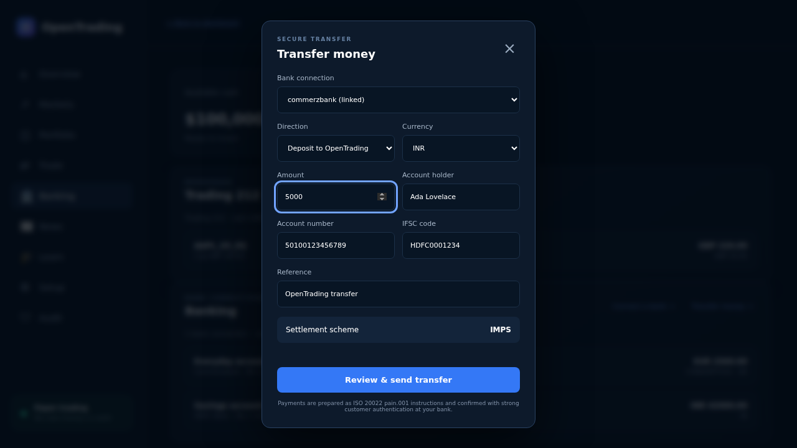
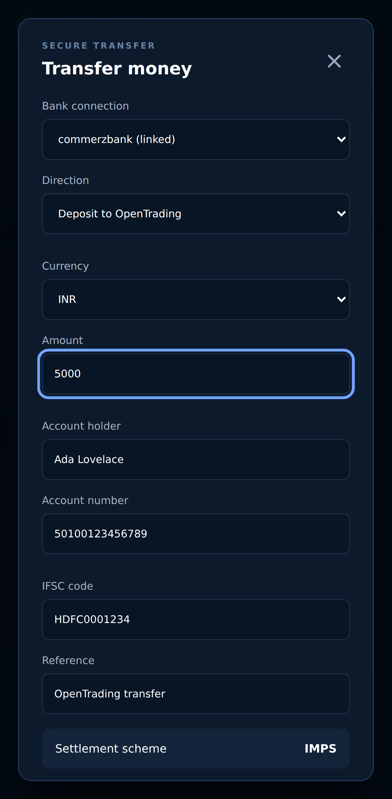
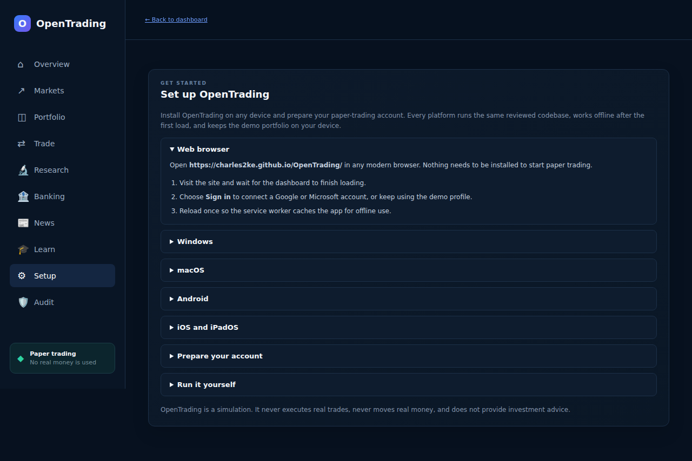
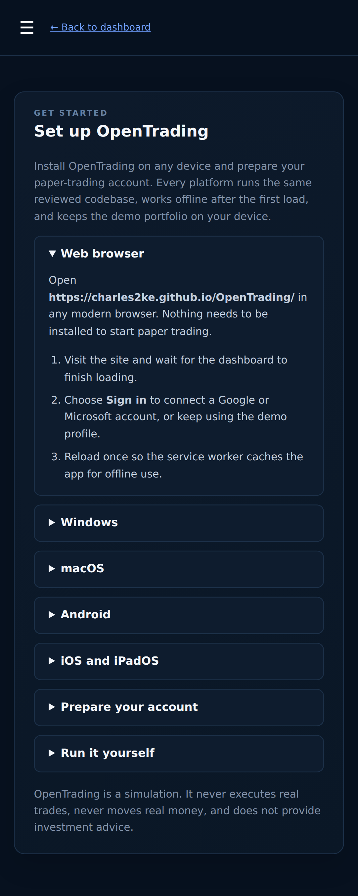
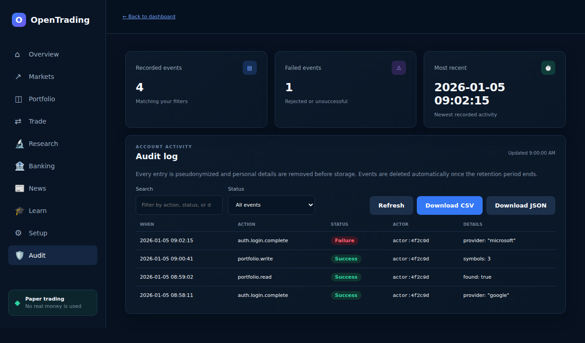
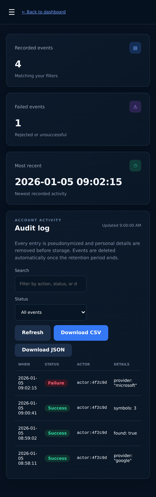

# OpenTrading

A fast, secure, installable paper-trading experience for global stock exchanges.

**Live site:** <https://charles2ke.github.io/OpenTrading/>

> **Simulation only:** OpenTrading does not execute real trades or provide investment advice. Market data is illustrative.

New to investing? Read the [beginner's investor concepts guide](docs/investor-concepts.md) for plain-language explanations and examples of stocks, short selling, calls, puts, and more. The same guide is available on the website on its own **Learn** page.

See the [architecture documentation](docs/architecture.md) for the client, server, data, authentication, and deployment design.

## Apps

- **Website:** responsive desktop and mobile experience.
- **Windows:** download the `.exe` installer (or portable `.zip`) for your chip from the latest release — both Intel/AMD `x64` and `arm64` (Snapdragon, Surface Pro) builds are published.
- **macOS:** download the `.dmg` (or `.zip`) for Apple silicon `arm64` or Intel `x64` from the latest release, or build it yourself on a Mac with `npm run desktop:pack:mac`.
- **Android:** open the website in Chrome and choose **Install app**.
- **iOS:** open the website in Safari, choose **Share**, then **Add to Home Screen**.

The Progressive Web App uses one reviewed codebase across all platforms, works offline after first load, and stores the demo portfolio only on the device.

## Features

- Global market overview across US, UK, German, and Japanese exchanges
- Search every listed market and index by name, ticker, exchange, country, or ISIN/CUSIP/SEDOL identifier
- Validated buy and sell paper orders
- Portfolio valuation, daily movement, cash, and returns
- Responsive, accessible UI with offline caching
- Connect any bank through Open Banking consent and review masked account details on a dedicated Banking page
- Built-in support for ICICI Bank, HDFC Bank, and State Bank of India (India), AIB and Bank of Ireland (Ireland), and ABN AMRO (Netherlands)
- Deposit and withdraw cash with ISO 20022 transfer instructions over SEPA, SWIFT, and the Indian IMPS and RTGS rails
- Read-only Trading 212 brokerage integration showing live cash, positions, and account value
- Built-in beginner's guide to investing concepts on a dedicated Learn page
- Setup page with installation steps for every platform and a first-run account checklist
- Audit log page to review your recorded account activity and download it as CSV or JSON
- Restrictive Content Security Policy and no analytics or remote scripts

## Screenshots

Every image below is captured automatically by `npx playwright test screenshots`, so the documentation always matches the shipped UI.

### Dashboard

| Desktop | Mobile |
| --- | --- |
|  |  |

### Navigation


### Placing an order

| Order ticket | Confirmation |
| --- | --- |
|  |  |

### Order validation


### Searching markets


### Loading the news feed

Animated placeholders keep the news panel in place while headlines are being fetched.


### Banking

| Linked accounts | Secure transfer |
| --- | --- |
|  |  |



Indian rupee transfers switch the dialog to account number and IFSC fields and settle over IMPS or RTGS.

| Desktop | Mobile |
| --- | --- |
|  |  |

### Beginner's guide


### Setup

| Desktop | Mobile |
| --- | --- |
|  |  |

### Audit log

| Desktop | Mobile |
| --- | --- |
|  |  |

## Development

Requires Node.js 22 or newer.

```bash
npm ci
npm run dev
```

Open <http://127.0.0.1:4173>.

### MongoDB

OpenTrading uses MongoDB for server-side portfolio persistence and falls back safely to on-device storage when the database is unavailable. Create a least-privilege database user, keep its connection string server-side, and start with:

```bash
MONGODB_URI='mongodb://localhost:27017' MONGODB_DATABASE='opentrading' npm run dev
```

Never expose `MONGODB_URI` to browser code or commit it to the repository.
The **Audit** page shows the signed-in user's own audit events and can export the filtered rows as CSV or JSON. MongoDB records use pseudonymous owner identifiers, scrub personally identifiable audit metadata, and apply retention for audit events (override with `AUDIT_RETENTION_DAYS` and `DATA_PRIVACY_KEY`).

### Authentication

Google and Microsoft login use OpenID Connect Authorization Code Flow with PKCE. Identity credentials and sessions remain server-side in MongoDB. Register these callback URLs with each provider:

- `https://your-host/auth/google/callback`
- `https://your-host/auth/microsoft/callback`

Then configure:

```bash
APP_BASE_URL='https://your-host' \
GOOGLE_CLIENT_ID='...' GOOGLE_CLIENT_SECRET='...' \
MICROSOFT_CLIENT_ID='...' MICROSOFT_CLIENT_SECRET='...' \
MONGODB_URI='...' npm run dev
```

Optionally set `MICROSOFT_TENANT_ID`; it defaults to `common`.

### Bank connections and transfers

Bank connections use an Open Banking (PSD2/FDX-style) provider. Consent is granted at your own bank, so OpenTrading never handles banking credentials, and only masked account details are shown. Transfers are prepared as ISO 20022 `pain.001` instructions and settle over SEPA for euro payments inside the SEPA zone or over SWIFT otherwise.

```bash
OPEN_BANKING_API_URL='https://api.your-provider.com/v1' \
OPEN_BANKING_API_KEY='...' \
OPEN_BANKING_REDIRECT_URI='https://your-host/banking.html' npm run dev
```

Keep `OPEN_BANKING_API_KEY` server-side. Without this configuration the banking endpoints return `503` and the Banking page explains that the feature is not configured; `GET /api/banking/institutions` still lists the built-in banks.

ICICI Bank, HDFC Bank, State Bank of India, AIB, Bank of Ireland, and ABN AMRO are always offered in the bank picker. Irish and Dutch euro payments settle over SEPA. Indian rupee payments use an account number and IFSC code instead of an IBAN and BIC and settle over IMPS, or over RTGS from ₹200,000.

### Trading 212

The Banking page also shows a read-only view of a Trading 212 account (cash, open positions, and account value). Create an API key in the Trading 212 app and keep it server-side:

```bash
TRADING212_API_KEY='...' TRADING212_ENVIRONMENT='demo' npm run dev
```

`TRADING212_ENVIRONMENT` accepts `live` (default) or `demo`, and `TRADING212_API_URL` can override the base URL. Without a key, `GET /api/broker/summary` returns `503` and the page explains that Trading 212 is not configured. OpenTrading never places real orders through the API.

### Windows desktop app

The desktop app is an Electron shell (`desktop/main.cjs`) around the same reviewed build. It serves the build over a secure `app://` scheme with context isolation, a sandboxed renderer, no Node integration, and navigation restricted to the packaged origin.

```bash
npm run desktop        # build the web assets and run the app locally
npm run desktop:pack   # build Windows x64 and arm64 installers into release/
```

Packaging Windows installers must run on a Windows machine or runner.

## Quality

```bash
npm run lint
npm run build
npm run test:unit
npx playwright install chromium
npm run test:e2e
```

Unit tests enforce 100% line, branch, and function coverage for trading, banking, persistence, MongoDB repositories, and authentication. Playwright exercises desktop, Android, and iOS experiences and captures screenshots. Each pull request receives a comment linking to its screenshot artifact.

## Deployment

Every merge to `main` builds and publishes the website to GitHub Pages. The `Build desktop apps` workflow builds `x64` and `arm64` Windows installers and macOS `.dmg`/`.zip` packages on every push and pull request and uploads them as artifacts; pushing a `v*` tag attaches them to a GitHub release. macOS packages are unsigned, so Gatekeeper asks for confirmation on first launch; set the `CSC_LINK` and `CSC_KEY_PASSWORD` secrets and drop `CSC_IDENTITY_AUTO_DISCOVERY: "false"` from the workflow to sign them. Successful merged pull requests also update the release status below.

<!-- release-status:start -->
Latest merged pull request: #20
<!-- release-status:end -->

## Security

Please report vulnerabilities privately through GitHub Security Advisories. Never include credentials or real financial information in issues.

## Privacy and terms

Read the [Privacy Policy](PRIVACY.md) for details on what data OpenTrading processes, where it is stored, and how long it is retained, and the [Terms of Service](TERMS.md) for the rules governing use of the Service.

Licensed under the [Apache License 2.0](LICENSE).
