# OpenTrading

A fast, secure, installable paper-trading experience for global stock exchanges.

**Live site:** <https://charles2ke.github.io/OpenTrading/>

> **Simulation only:** OpenTrading does not execute real trades or provide investment advice. Market data is illustrative.

New to investing? Read the [beginner's investor concepts guide](docs/investor-concepts.md) for plain-language explanations and examples of stocks, short selling, calls, puts, and more. The same guide is available on the website on its own **Learn** page.

See the [architecture documentation](docs/architecture.md) for the client, server, data, authentication, and deployment design.

## Apps

- **Website:** responsive desktop and mobile experience.
- **Android:** open the website in Chrome and choose **Install app**.
- **iOS:** open the website in Safari, choose **Share**, then **Add to Home Screen**.

The Progressive Web App uses one reviewed codebase across all platforms, works offline after first load, and stores the demo portfolio only on the device.

## Features

- Global market overview across US, UK, German, and Japanese exchanges
- Search every listed market and index by name, ticker, exchange, country, or ISIN/CUSIP/SEDOL identifier
- Validated buy and sell paper orders
- Portfolio valuation, daily movement, cash, and returns
- Responsive, accessible UI with offline caching
- Connect any bank through Open Banking consent and review masked account details
- Deposit and withdraw cash with ISO 20022 (SEPA and SWIFT) transfer instructions
- Built-in beginner's guide to investing concepts on a dedicated Learn page
- Restrictive Content Security Policy and no analytics or remote scripts

## Screenshots

Every image below is captured automatically by `npx playwright test screenshots`, so the documentation always matches the shipped UI.

### Dashboard

| Desktop | Mobile |
| --- | --- |
| 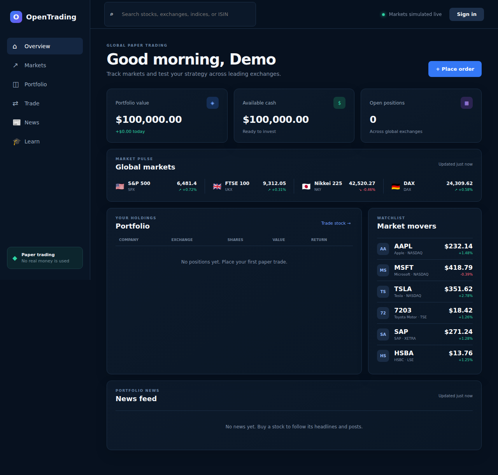 | 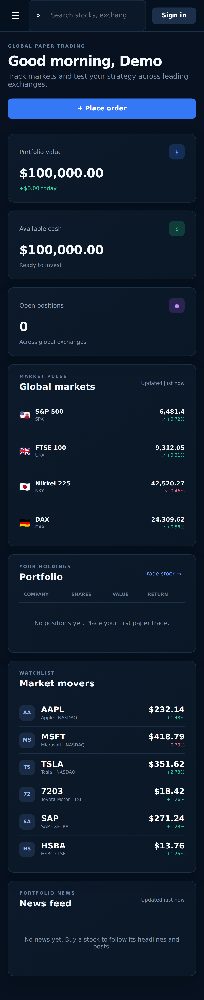 |

### Navigation

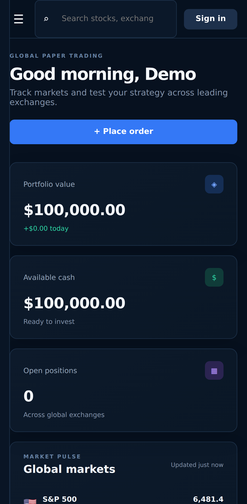

### Placing an order

| Order ticket | Confirmation |
| --- | --- |
| 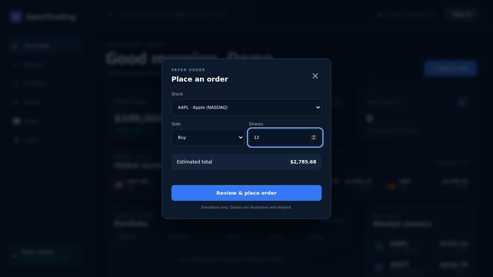 | 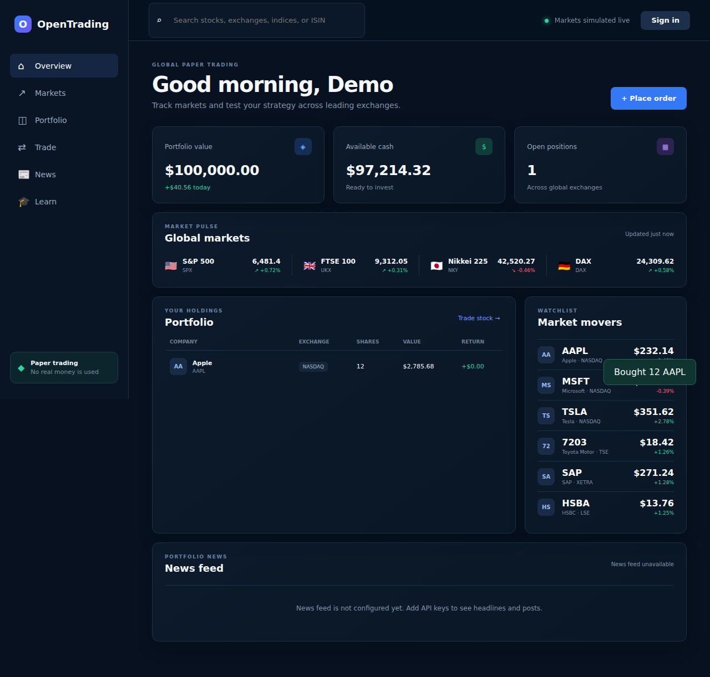 |

### Order validation

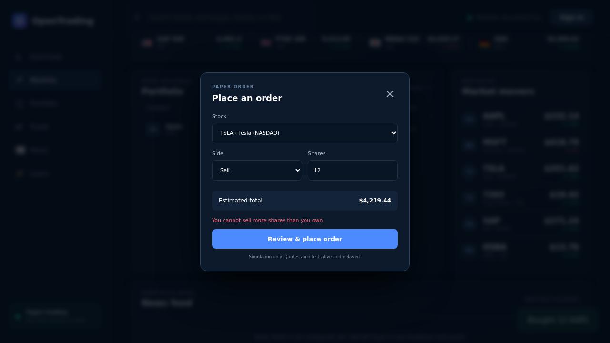

### Searching markets

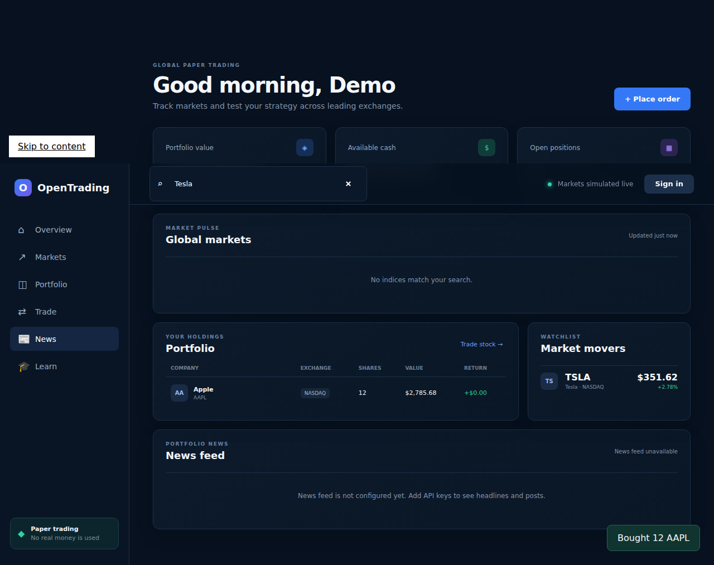

### Loading the news feed

Animated placeholders keep the news panel in place while headlines are being fetched.

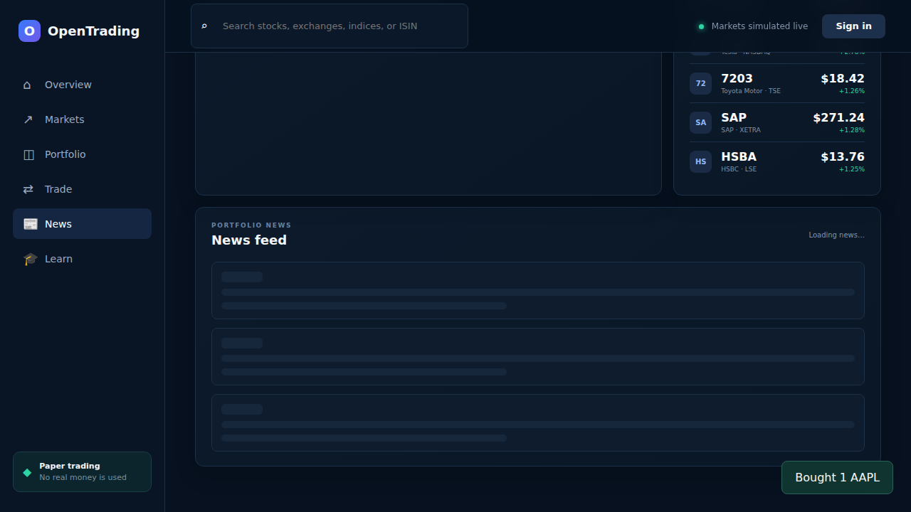
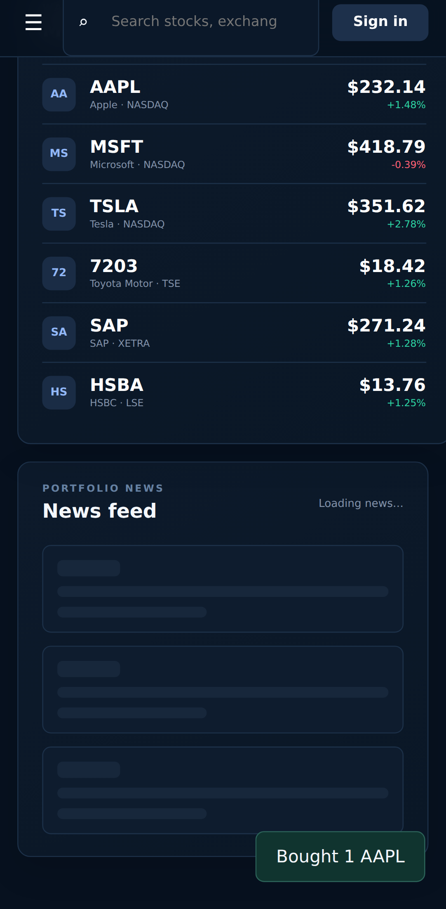

### Banking

| Linked accounts | Secure transfer |
| --- | --- |
| 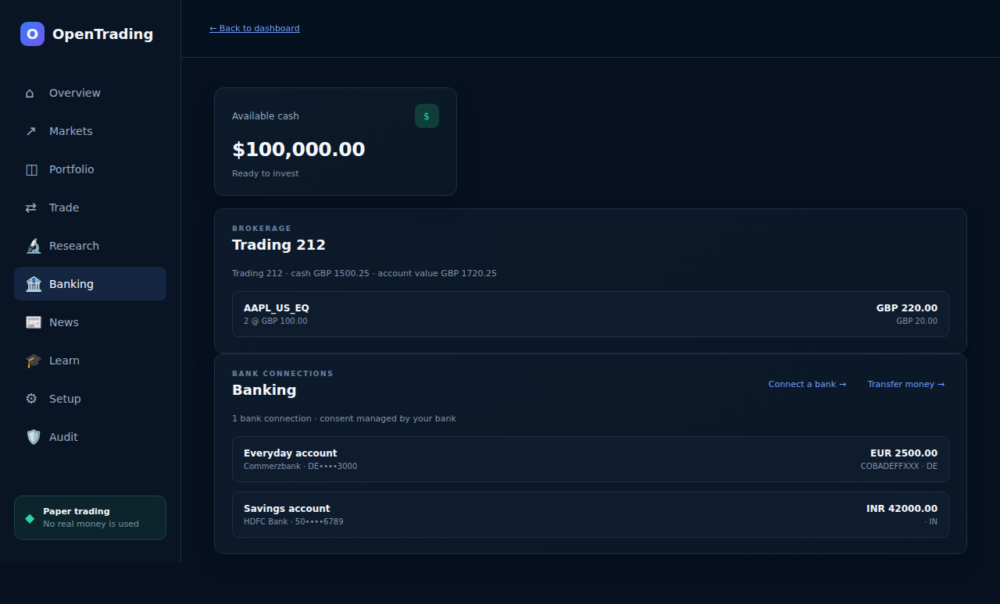 | 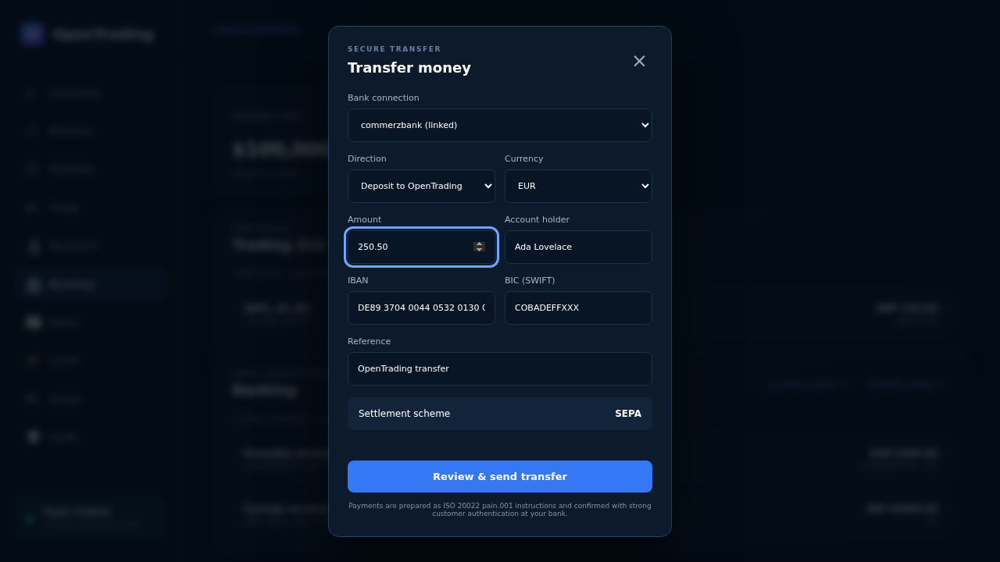 |

### Beginner's guide

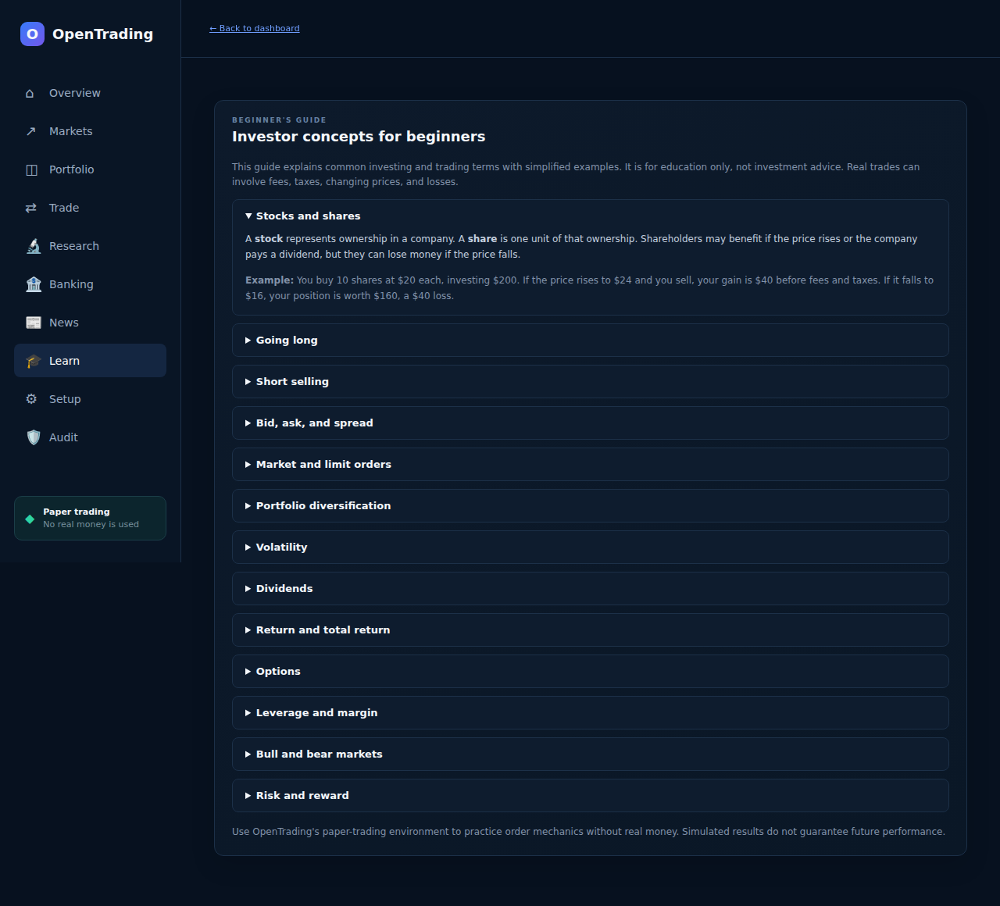

## Development

Requires Node.js 22 or newer.

```bash
npm ci
npm run dev
```

Open <http://127.0.0.1:4173>.

### MongoDB

OpenTrading uses MongoDB for server-side portfolio persistence and falls back safely to on-device storage when the database is unavailable. Create a least-privilege database user, keep its connection string server-side, and start with:

```bash
MONGODB_URI='mongodb://localhost:27017' MONGODB_DATABASE='opentrading' npm run dev
```

Never expose `MONGODB_URI` to browser code or commit it to the repository.
MongoDB records use pseudonymous owner identifiers, scrub personally identifiable audit metadata, and apply retention for audit events (override with `AUDIT_RETENTION_DAYS` and `DATA_PRIVACY_KEY`).

### Authentication

Google and Microsoft login use OpenID Connect Authorization Code Flow with PKCE. Identity credentials and sessions remain server-side in MongoDB. Register these callback URLs with each provider:

- `https://your-host/auth/google/callback`
- `https://your-host/auth/microsoft/callback`

Then configure:

```bash
APP_BASE_URL='https://your-host' \
GOOGLE_CLIENT_ID='...' GOOGLE_CLIENT_SECRET='...' \
MICROSOFT_CLIENT_ID='...' MICROSOFT_CLIENT_SECRET='...' \
MONGODB_URI='...' npm run dev
```

Optionally set `MICROSOFT_TENANT_ID`; it defaults to `common`.

### Bank connections and transfers

Bank connections use an Open Banking (PSD2/FDX-style) provider. Consent is granted at your own bank, so OpenTrading never handles banking credentials, and only masked account details are shown. Transfers are prepared as ISO 20022 `pain.001` instructions and settle over SEPA for euro payments inside the SEPA zone or over SWIFT otherwise.

```bash
OPEN_BANKING_API_URL='https://api.your-provider.com/v1' \
OPEN_BANKING_API_KEY='...' \
OPEN_BANKING_REDIRECT_URI='https://your-host/#banking' npm run dev
```

Keep `OPEN_BANKING_API_KEY` server-side. Without this configuration the banking endpoints return `503` and the banking panel explains that the feature is not configured.

## Quality

```bash
npm run lint
npm run build
npm run test:unit
npx playwright install chromium
npm run test:e2e
```

Unit tests enforce 100% line, branch, and function coverage for trading, banking, persistence, MongoDB repositories, and authentication. Playwright exercises desktop, Android, and iOS experiences and captures screenshots. Each pull request receives a comment linking to its screenshot artifact.

## Deployment

Every merge to `main` builds and publishes the website to GitHub Pages. Successful merged pull requests also update the release status below.

<!-- release-status:start -->
No pull request has been merged yet.
<!-- release-status:end -->

## Security

Please report vulnerabilities privately through GitHub Security Advisories. Never include credentials or real financial information in issues.

Licensed under the [Apache License 2.0](LICENSE).
