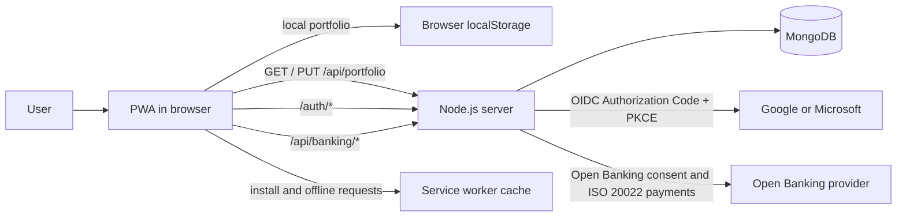
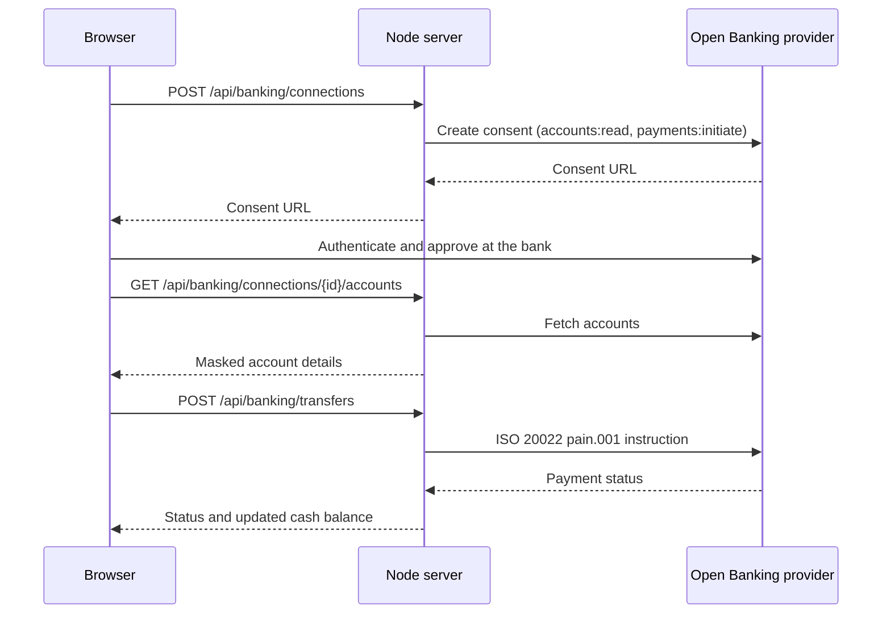

# Architecture

OpenTrading is a Progressive Web App (PWA) for simulated stock trading. The browser provides the trading experience and keeps a local portfolio so that the application remains useful offline. An optional Node.js service and MongoDB database add portfolio persistence and OpenID Connect sign-in.

## System overview



## Client application

- `index.html` defines the accessible dashboard shell and loads the application entry point.
- `src/main.jsx` mounts the React authentication controls. The trading dashboard in `src/app.js` uses the DOM directly to render market data, positions, order feedback, and installation controls.
- `src/core/trading.js` is the domain layer. It contains the fixed, illustrative market data and validates orders, executes trades, summarizes portfolios, and verifies portfolio shapes.
- `audit.html` and `src/audit.js` render the audit log page. It loads the signed-in user's pseudonymized audit events, filters them by text and status, and exports the filtered rows to CSV or JSON with `src/core/audit.js`.
- `src/core/banking.js` is the banking domain layer. It validates IBANs with the ISO 13616 mod-97 checksum, validates ISO 9362 BIC codes, masks account identifiers, decides between the SEPA and SWIFT settlement schemes, and builds ISO 20022 `pain.001` payment instructions.
- `banking.html` and `src/banking.js` render the banking page, which shows the available cash balance and reuses `src/banking-ui.js`.
- `src/banking-ui.js` renders the bank connections panel, the bank consent dialog, and the transfer dialog, and talks to the `/api/banking/*` endpoints.
- `src/core/storage.js` is the persistence adapter. It reads and writes the local portfolio and client identifier, then synchronizes the portfolio with the optional server API.
- `public/manifest.webmanifest` and `public/service-worker.js` make the site installable. The service worker precaches essential application assets and caches successful same-origin GET responses for offline fallback.

The client starts with a local portfolio. When remote persistence is available, it loads the remote portfolio after the initial render and sends successful order updates to `PUT /api/portfolio`. A missing or unavailable remote store leaves the local portfolio in place.

## Server and data

`scripts/server.js` serves the built Vite output and exposes the application API:

| Route | Purpose |
| --- | --- |
| `GET /api/portfolio` | Returns the current portfolio, or `404` when none exists. |
| `PUT /api/portfolio` | Validates and saves a portfolio. |
| `GET /api/audit` | Returns the signed-in user's own audit events, newest first, capped by `limit` (default 200, maximum 1000). Returns `401` when signed out and `503` without a database. |
| `GET /api/securities` | Returns cached securities with ticker, ISIN, CUSIP, and SEDOL identifiers. |
| `GET /api/securities/{identifierType}/{identifier}` | Returns one cached security by `symbol`, `ticker`, `isin`, `cusip`, or `sedol`. |
| `GET /api/banking/institutions` | Lists banks that can be connected, optionally filtered by `country`. |
| `GET /api/banking/connections` | Lists the caller's bank connections. |
| `POST /api/banking/connections` | Starts a consent flow for one bank and returns its consent URL. |
| `GET /api/banking/connections/{connectionId}/accounts` | Returns masked account details for a linked bank. |
| `DELETE /api/banking/connections/{connectionId}` | Removes a bank connection. |
| `POST /api/banking/transfers` | Validates and submits an ISO 20022 transfer, then settles the cash balance. |
| `GET /auth/session` | Returns the signed-in user, if present. |
| `GET /auth/google` and `GET /auth/microsoft` | Starts the corresponding sign-in flow. |
| `GET /auth/{provider}/callback` | Completes the provider callback. |
| `POST /auth/logout` | Deletes the current session. |

### Securities cache flow

```mermaid
flowchart LR
  TradingData[src/core/trading.js instruments] --> Cache[SecuritiesCache in memory]
  Cache -->|GET /api/securities| ListEndpoint[List all securities]
  Cache -->|GET /api/securities/symbol/{value}| SymbolEndpoint[Lookup by symbol]
  Cache -->|GET /api/securities/ticker/{value}| TickerEndpoint[Lookup by ticker]
  Cache -->|GET /api/securities/isin/{value}| IsinEndpoint[Lookup by ISIN]
  Cache -->|GET /api/securities/cusip/{value}| CusipEndpoint[Lookup by CUSIP]
  Cache -->|GET /api/securities/sedol/{value}| SedolEndpoint[Lookup by SEDOL]
```

### Bank connections and transfers

`src/server/bank-service.js` talks to an Open Banking (PSD2/FDX-style) aggregator over HTTPS using a bearer API key that never reaches the browser. Consent happens at the user's own bank, so OpenTrading never sees banking credentials. Only pseudonymous connection references are stored in MongoDB; account numbers are masked before they leave the server, and IBAN, BIC, and account numbers are redacted from audit metadata.

Transfers are validated against the portfolio and payment standards (ISO 4217 currency, ISO 13616 IBAN, ISO 9362 BIC, two-decimal amounts, per-instruction limit) and then serialized as an ISO 20022 `pain.001.001.09` credit-transfer instruction. Euro payments inside the SEPA zone use the SEPA scheme; everything else settles over SWIFT. The provider performs strong customer authentication before the payment is executed.



When `MONGODB_URI` is configured, `src/server/portfolio-repository.js` creates MongoDB-backed portfolio, authentication, audit, and bank-connection stores. Portfolio owners and audit actors are persisted as pseudonymous keyed hashes rather than raw identifiers, session records keep only minimal display data, and audit metadata is scrubbed for PII before insert. The database also holds short-lived OIDC states and sessions, plus expiring audit events; TTL indexes remove expired records.

Audit history is readable only by its own actor: the API resolves the session user, hashes the identifier with the privacy key, and queries only events stored under that actor key. Metadata is scrubbed again on read, and downloads are generated in the browser from the rows already returned to the page.

MongoDB and authentication are optional. Without a database connection, portfolio and authentication endpoints return `503`, while client-side paper trading and local storage continue to work.

## Authentication and security

`src/server/auth.js` implements Google and Microsoft OpenID Connect Authorization Code Flow with PKCE. It stores the authorization state and PKCE verifier server-side, validates the callback state, and issues an opaque, HTTP-only, secure, `SameSite=Lax` session cookie.

The Node server and page define a restrictive same-origin Content Security Policy. The server also sends frame, MIME-sniffing, referrer, and cross-origin opener protections. API responses are not cached, request bodies are limited to 16 KiB, and portfolio payloads are validated on both the client and server.

## Build and deployment

Vite builds the browser assets into `dist/`. `npm run dev` first builds those assets and then starts the Node server on `127.0.0.1:4173`. GitHub Pages deployment publishes the static build for the PWA; a deployment that needs remote portfolios or sign-in must also run the Node server with MongoDB and the relevant OIDC configuration.

## Quality boundaries

Unit tests cover trading, banking, local storage, repositories, and authentication. Playwright covers the desktop, Android, and iOS dashboard flows. The pull-request workflow runs linting, unit tests, builds the application, runs Playwright, and uploads the captured screenshots as a PR artifact.
