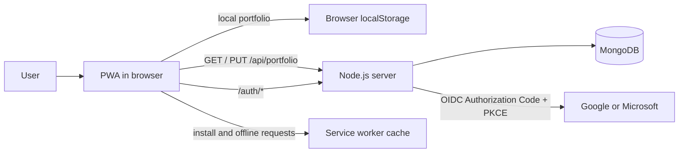

# Architecture

OpenTrading is a Progressive Web App (PWA) for simulated stock trading. The browser provides the trading experience and keeps a local portfolio so that the application remains useful offline. An optional Node.js service and MongoDB database add portfolio persistence and OpenID Connect sign-in.

## System overview



## Client application

- `index.html` defines the accessible dashboard shell and loads the application entry point.
- `src/main.jsx` mounts the React authentication controls. The trading dashboard in `src/app.js` uses the DOM directly to render market data, positions, order feedback, and installation controls.
- `src/core/trading.js` is the domain layer. It contains the fixed, illustrative market data and validates orders, executes trades, summarizes portfolios, and verifies portfolio shapes.
- `src/core/storage.js` is the persistence adapter. It reads and writes the local portfolio and client identifier, then synchronizes the portfolio with the optional server API.
- `public/manifest.webmanifest` and `public/service-worker.js` make the site installable. The service worker precaches essential application assets and caches successful same-origin GET responses for offline fallback.

The client starts with a local portfolio. When remote persistence is available, it loads the remote portfolio after the initial render and sends successful order updates to `PUT /api/portfolio`. A missing or unavailable remote store leaves the local portfolio in place.

## Server and data

`scripts/server.js` serves the built Vite output and exposes the application API:

| Route | Purpose |
| --- | --- |
| `GET /api/portfolio` | Returns the current portfolio, or `404` when none exists. |
| `PUT /api/portfolio` | Validates and saves a portfolio. |
| `GET /api/securities` | Returns cached securities with ticker, ISIN, CUSIP, and SEDOL identifiers. |
| `GET /api/securities/{identifierType}/{identifier}` | Returns one cached security by `symbol`, `ticker`, `isin`, `cusip`, or `sedol`. |
| `GET /auth/session` | Returns the signed-in user, if present. |
| `GET /auth/google` and `GET /auth/microsoft` | Starts the corresponding sign-in flow. |
| `GET /auth/{provider}/callback` | Completes the provider callback. |
| `POST /auth/logout` | Deletes the current session. |

### Securities cache flow

```mermaid
flowchart LR
  TradingData[src/core/trading.js instruments] --> Cache[SecuritiesCache in memory]
  Cache -->|GET /api/securities| ListEndpoint[List all securities]
  Cache -->|GET /api/securities/symbol/{value}| SymbolEndpoint[Lookup by symbol]
  Cache -->|GET /api/securities/ticker/{value}| TickerEndpoint[Lookup by ticker]
  Cache -->|GET /api/securities/isin/{value}| IsinEndpoint[Lookup by ISIN]
  Cache -->|GET /api/securities/cusip/{value}| CusipEndpoint[Lookup by CUSIP]
  Cache -->|GET /api/securities/sedol/{value}| SedolEndpoint[Lookup by SEDOL]
```

When `MONGODB_URI` is configured, `src/server/portfolio-repository.js` creates a MongoDB-backed portfolio repository and authentication store. Portfolios are keyed by a signed-in user's provider subject or, for anonymous usage, a browser-generated UUID. The database also holds short-lived OIDC states and sessions; TTL indexes remove expired records.

MongoDB and authentication are optional. Without a database connection, portfolio and authentication endpoints return `503`, while client-side paper trading and local storage continue to work.

## Authentication and security

`src/server/auth.js` implements Google and Microsoft OpenID Connect Authorization Code Flow with PKCE. It stores the authorization state and PKCE verifier server-side, validates the callback state, and issues an opaque, HTTP-only, secure, `SameSite=Lax` session cookie.

The Node server and page define a restrictive same-origin Content Security Policy. The server also sends frame, MIME-sniffing, referrer, and cross-origin opener protections. API responses are not cached, request bodies are limited to 16 KiB, and portfolio payloads are validated on both the client and server.

## Build and deployment

Vite builds the browser assets into `dist/`. `npm run dev` first builds those assets and then starts the Node server on `127.0.0.1:4173`. GitHub Pages deployment publishes the static build for the PWA; a deployment that needs remote portfolios or sign-in must also run the Node server with MongoDB and the relevant OIDC configuration.

## Quality boundaries

Unit tests cover trading, local storage, repositories, and authentication. Playwright covers the desktop, Android, and iOS dashboard flows. The pull-request workflow runs linting, unit tests, builds the application, runs Playwright, and uploads the captured screenshots as a PR artifact.
